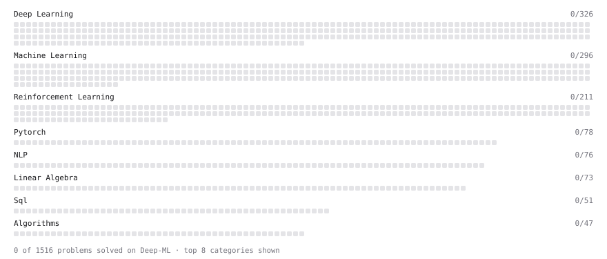

# Deep-ML

My machine learning practice from [Deep-ML](https://www.deep-ml.com). Every solution here was written by hand.

**9** solved · 0 problems · 0 labs · 9 math

[**Browse the interactive portfolio**](https://oscar-palomo.github.io/deep-ml/) to replay this filling in over time.

## Math

| | Difficulty | Solved | |
| --- | --- | --- | --- |
| [Derivatives and Gradients](https://www.deep-ml.com/math-problems/1) | easy | 2026-10-08 | [solution](math/0001-derivatives-and-gradients) |
| [Descriptive Statistics](https://www.deep-ml.com/math-problems/18) | easy | 2026-10-08 | [solution](math/0018-descriptive-statistics) |
| [Expectation and Variance Algebra](https://www.deep-ml.com/math-problems/33) | easy | 2026-10-09 | [solution](math/0033-expectation-and-variance-algebra) |
| [Gradient Descent Updates](https://www.deep-ml.com/math-problems/5) | easy | 2026-10-08 | [solution](math/0005-gradient-descent-updates) |
| [Matrix Basics](https://www.deep-ml.com/math-problems/9) | easy | 2026-10-09 | [solution](math/0009-matrix-basics) |
| [Probability Fundamentals](https://www.deep-ml.com/math-problems/19) | easy | 2026-10-09 | [solution](math/0019-probability-fundamentals) |
| [Standard Error and the Sampling Distribution of an Estimator](https://www.deep-ml.com/math-problems/73) | easy | 2026-10-09 | [solution](math/0073-standard-error-and-the-sampling-distribution-of-an-estimator) |
| [Vector Operations](https://www.deep-ml.com/math-problems/7) | easy | 2026-10-05 | [solution](math/0007-vector-operations) |
| [Matrix Multiplication](https://www.deep-ml.com/math-problems/10) | medium | 2026-10-09 | [solution](math/0010-matrix-multiplication) |

---

_This file is regenerated by Deep-ML on every push._
